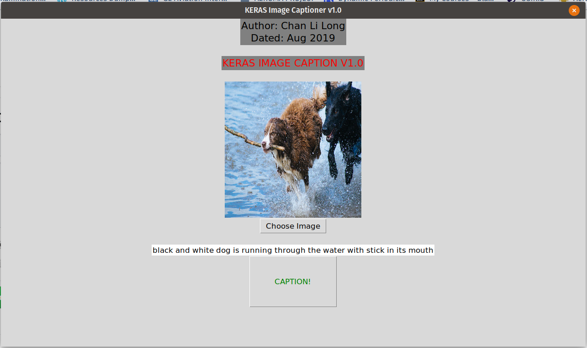

# Keras_image_caption

This is a demonstration of a Image Captioning GUI program using Keras on a Pretrained Model.
This model is trained on the flickr30k dataset.

Open the directory in terminal and run the .py file.
Make sure you have all the dependencies installed.

